# BeHuman — Especificação Técnica e de Negócio

**Documento de handoff para fábrica de software**

| | |
|---|---|
| **Produto** | BeHuman — Plataforma de Inteligência de Pessoas com IA |
| **Marca de interface** | beculture® |
| **Versão do documento** | 1.0 |
| **Data** | 15/07/2026 |
| **Destinatário** | Fábrica de software / squad de engenharia terceirizado |
| **Stack-alvo** | React + TypeScript + TailwindCSS (frontend) · NestJS + Prisma + PostgreSQL (backend) |
| **Design System** | Já existente (template pronto — ver §4.4). **Não** faz parte do escopo recriá-lo. |

---

## 0. Como ler este documento

Este documento descreve **o que** o BeHuman é (visão de negócio) e **como** ele deve ser construído (arquitetura técnica), para que uma fábrica de software consiga implementá-lo do zero — ou evoluir a base existente — sem depender de conhecimento tácito.

Três requisitos são **inegociáveis** e aparecem repetidos ao longo do texto porque orientam decisões de arquitetura:

1. **Contratação self-service no modelo trial, igual ao ClickUp** — o cliente entra num site, escolhe módulos/plano, começa um teste grátis de 14 dias sem cartão e converte em assinatura paga sem falar com vendas. (§2)
2. **Hierarquia organizacional de três níveis: Grupo de Empresas → Empresa → Usuários.** (§3)
3. **A IA pode ser corporativa (chave do cliente / BYOK) ou gerida por nós (chave da plataforma).** (§6.1)

Convenções:
- 🟢 **Implementado** — já existe na base de código de referência.
- 🟡 **Parcial / placeholder** — a tela existe mas está "em construção".
- 🔴 **A construir** — requisito novo que a fábrica deve implementar.

Todas as capturas de tela deste documento estão na pasta [`prints/`](prints/) e refletem a base de referência real.

---

## 1. Visão de Produto

### 1.1. O que é o BeHuman

O BeHuman é uma **plataforma SaaS de inteligência de pessoas** voltada a líderes, CEOs e áreas de RH/Gente & Gestão. Ele combina três coisas num só lugar:

1. **Squads de IA** — grupos de agentes especialistas (Cultura, Financeiro, Jurídico, Gestão de Pessoas, Conselho Administrativo etc.). Cada agente **personifica uma referência humana** (ex.: Peter Drucker em Governança, Michael Porter em Estratégia) e responde no contexto da empresa do cliente.
2. **Memória corporativa de longo prazo** — uma base de conhecimento por empresa que a IA "lembra" e injeta em toda resposta, personalizando o atendimento.
3. **Insights e produtividade** — sinais gerados por IA sobre a operação de pessoas (risco de turnover, engajamento, avaliações atrasadas) e um "estúdio" de IA para criar conteúdo (atas, apresentações, artigos, imagens, vídeos).

A tese de produto: **transformar dados dispersos de pessoas e operação em decisões e ações**, com a IA agindo como um "business partner" sempre disponível.

### 1.2. Proposta de valor

| Para quem | Dor | Como o BeHuman resolve |
|---|---|---|
| CEO / Fundador | Decisões estratégicas sem sparring qualificado | Squad "Conselho Administrativo" com agentes de governança, estratégia e risco |
| RH / Gente & Gestão | Sinais de pessoas espalhados em várias ferramentas | Insights unificados + conectores (Slack, Teams, LMS, folha) |
| Líder de área | Falta de tempo para produzir comunicação/documentação | IA Studio: ata, apresentação, artigo, carrossel, vídeo a partir de um input |
| Toda a empresa | IA genérica que não conhece o contexto do negócio | Memória corporativa + squads treinados no perfil da empresa |

### 1.3. Conceitos-chave (glossário rápido)

- **Grupo de Empresas** — holding / rede que agrupa várias empresas (tenants) sob uma administração comum. 🔴
- **Empresa (Tenant)** — a unidade que contrata e é isolada das demais. 🟢
- **Usuário** — quem faz login; pertence a uma empresa e tem um papel. 🟢
- **Produto** — grande área funcional (BeHuman, Learning, Performance, Project Management, Hiring). 🟢/🟡
- **Squad** — grupo de agentes de IA de um domínio (ex.: Cultura). 🟢
- **Agente** — persona de IA dentro de um squad, com prompt-base próprio e referência humana. 🟢
- **Memória (Diretriz)** — fato que a IA memoriza sobre a empresa e reusa nas respostas. 🟢
- **Insight** — sinal/alerta gerado por IA a partir dos dados das áreas. 🟢
- **Conector** — integração com uma ferramenta externa (Slack, Teams, Gupy…). 🟢
- **IA Studio** — conjunto de funções nativas de geração de conteúdo. 🟢
- **BYOK** (*Bring Your Own Key*) — a empresa conecta a própria chave de IA. 🟢

---

## 2. Modelo de Negócio e Contratação (modelo ClickUp / trial)

> **Requisito central:** a arquitetura DEVE permitir a contratação inteiramente self-service, através de um site público, no mesmo modelo do ClickUp: o cliente escolhe o que quer, inicia um **teste grátis de 14 dias sem cartão de crédito** e converte em assinatura paga sozinho.

### 2.1. Jornada de contratação (funil)

```
Site público / landing  →  Página de planos  →  /cadastro (trial)  →  Auto-login
        │                        │                     │                    │
   (marketing)            escolhe módulo         cria Empresa + Owner    entra no app
                          + plano + ciclo        + Assinatura (trial)    em trial
                          + nº de usuários                                    │
                                                                     14 dias de uso
                                                                             │
                                                              Checkout (Pix/Cartão/Boleto)
                                                                             │
                                                                   Assinatura ATIVA
```

### 2.2. Tela de cadastro / início de trial 🟢

A tela `/cadastro` concentra toda a decisão de compra numa única página, com **preço calculado ao vivo** conforme o cliente ajusta módulos, plano, ciclo e quantidade de usuários.

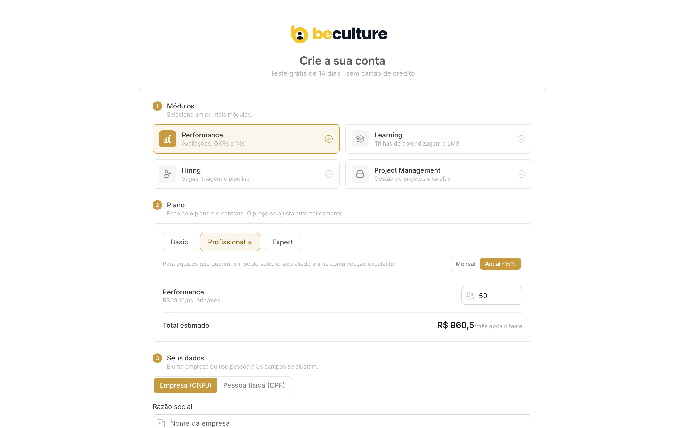

Elementos obrigatórios da tela (todos presentes na referência):

1. **Módulos** — seleção de um ou mais: Performance, Learning, Hiring, Project Management.
2. **Plano** — Basic · Profissional · Expert (com destaque "mais escolhido").
3. **Ciclo** — Mensal ou **Anual (−15%)**.
4. **Quantidade** — nº de usuários (ou posições, no caso de Hiring).
5. **Total estimado ao vivo** — "R$ X/mês após o teste".
6. **Seus dados** — alternância **Empresa (CNPJ)** vs **Pessoa física (CPF)**, com campos que se ajustam.
7. Selo permanente: **"Teste grátis de 14 dias · sem cartão de crédito"**.

### 2.3. Planos e módulos

**Planos** (metadados de exibição — a precificação vive em tabela à parte):

| Código | Nome comercial | Público | Destaques |
|---|---|---|---|
| `basico` | **Basic** | Equipes que só precisam do módulo escolhido | Recrutamento até 5 vagas/mês, Performance básico, clima trimestral, suporte por chat |
| `profissional` | **Profissional** ⭐ | Quem quer o módulo + comunicação de excelência | Recrutamento ilimitado, OKRs completo, clima contínuo + IA de turnover, CSM dedicado |
| `corporativo` | **Expert** | Excelência em IA e escala | Tudo do Profissional + **SSO/SAML**, **API dedicada**, **multi-empresa**, LGPD avançado, SLA 99,9%, 24/7 |

**Módulos** e base de cobrança:

| Módulo | Descrição | Unidade de cobrança |
|---|---|---|
| Performance | Avaliações, OKRs e 1:1s | por **usuário** |
| Learning | Trilhas de aprendizagem e LMS | por **usuário** |
| Project Management | Gestão de projetos e tarefas | por **usuário** |
| Hiring | Vagas, triagem e pipeline | por **posição** (vaga) |

### 2.4. Regras de precificação 🟢

- Preço = **valor unitário × quantidade**, por mês. O unitário varia por **módulo × contrato (mensal/anual) × plano × faixa de quantidade** (faixas: 1–10, 11–25, 26–50, …).
- **Contrato anual aplica −15%** sobre o mensal.
- **Multi-módulo** (módulos por usuário): preço/usuário = preço do **plano** (1×) + **Básico** de cada módulo adicional. Ex.: Profissional + 2 módulos extras = Profissional + Básico + Básico (nunca 2× Profissional).
- **Hiring** é por posição (unidade diferente) → calculado isoladamente, sem combinar com os de usuário.
- `preço = 0` significa **"sob consulta"** (faixa sem tabela / Expert enterprise).
- A tabela de preços deve ser **parametrizável** (hoje é uma tabela de faixas em código; recomenda-se persistir em banco para o time comercial editar sem deploy). 🔴

### 2.5. Ciclo de vida da assinatura 🟢

Estados (enum `StatusAssinatura`): `trial → ativa → inadimplente → expirada → cancelada`.

```
  cadastro
     │
     ▼
  [trial] ──(14 dias sem pagar)──▶ [expirada] ──(paga)──▶ [ativa]
     │                                                       │
     └──────────(checkout dentro do trial)──────────────────┘
                                                             │
                                          (falha de cobrança) ▼
                                                      [inadimplente] ──(regulariza)──▶ [ativa]
                                                             │
                                                     (cancelamento) ▼
                                                        [cancelada]
```

- O **trial é contado por usuário** (`trialStartsAt`/`trialEndsAt` em `Usuario`) e também registrado na `Assinatura`.
- A `Assinatura` guarda um **snapshot de preços** no momento da contratação (`precoUsuario`, `precoPosicao`, `total`), para não sofrer com mudanças futuras de tabela.

### 2.6. Gateway de pagamento (abstração obrigatória) 🟢/🔴

O app **nunca** deve falar com o gateway diretamente. Toda cobrança passa por uma **interface `BillingService`**:

```ts
interface BillingService {
  criarTrial(input: CriarTrialInput): Promise<Assinatura>;     // sem cobrança
  obterAssinatura(empresaId: string): Promise<Assinatura | null>;
  ativarAssinatura(input: AtivarAssinaturaInput): Promise<Assinatura>; // checkout
  cancelar(empresaId: string): Promise<void>;
}
```

- **Fase 1 (referência atual):** `MockBilling` (localStorage / pagamento simulado) — permite construir o funil inteiro sem integração real.
- **Fase 2 (a implementar):** `IuguBilling` implementando o mesmo contrato. Gateway sugerido: **Iugu** (Pix, cartão, boleto). O campo `gatewayRef` na `Assinatura` guarda a referência do objeto no gateway. 🔴

> Métodos de pagamento previstos (enum `MetodoPagamento`): `pix`, `cartao`, `boleto`.

---

## 3. Modelo Organizacional e Multi-tenancy

> **Requisito central:** a estrutura precisa comportar **Grupo de Empresas → Empresas → Usuários**.

### 3.1. Hierarquia-alvo

```
┌─────────────────────────────────────────────────────────┐
│  GRUPO DE EMPRESAS (holding / rede)            🔴 novo   │
│  · administração e faturamento consolidados              │
│  · políticas e memórias corporativas herdáveis           │
│  ┌───────────────────────┐   ┌───────────────────────┐  │
│  │ EMPRESA A (tenant) 🟢 │   │ EMPRESA B (tenant) 🟢 │  │
│  │  · plano/assinatura    │   │  · plano/assinatura   │  │
│  │  · conexão de IA       │   │  · conexão de IA      │  │
│  │  · memória, conectores │   │  · memória, conectores│  │
│  │  ┌─────────┐ ┌───────┐ │   │  ┌─────────┐          │  │
│  │  │Usuário 1│ │Usuár.2│ │   │  │Usuário 3│   …      │  │
│  │  └─────────┘ └───────┘ │   │  └─────────┘          │  │
│  └───────────────────────┘   └───────────────────────┘  │
└─────────────────────────────────────────────────────────┘
```

### 3.2. Estado atual vs. requisito

- 🟢 **Empresa → Usuários** já existe e é o eixo de multi-tenancy. `Empresa` é o **tenant**; todos os dados (memória, conversas, conectores, uso de IA, assinatura) são escopados por `empresaId`.
- 🔴 **Grupo de Empresas** é a camada a **adicionar**. Recomendação de modelagem:
  - Nova entidade `GrupoEmpresas` (id, razão social do grupo, admin owner).
  - `Empresa` ganha `grupoId String?` (nulo = empresa avulsa, sem grupo).
  - Faturamento consolidado: a `Assinatura` pode ser por empresa (padrão) **ou** por grupo (enterprise) — prever `grupoId?` na `Assinatura`.
  - **Memórias e diretrizes corporativas** podem existir no nível do grupo e serem **herdadas** por todas as empresas (ver §6.4).
  - **Squads custom** podem existir no nível do grupo/empresa (o catálogo hoje é global; o schema já prevê a extensão `empresaId String?` em `Squad`/`SquadAgent`).

### 3.3. Papéis e permissões (RBAC) 🟢

Enum `UserRole`: `owner`, `admin`, `membro`.

| Ação | owner | admin | membro |
|---|:--:|:--:|:--:|
| Usar squads, IA, memória, conectores | ✅ | ✅ | ✅ |
| Convidar/remover usuários | ✅ | ✅ | — |
| Gerir assinatura / pagamento | ✅ | — | — |
| Configurar conexão de IA (BYOK) | ✅ | ✅ | — |
| Editar memórias corporativas (read-only p/ membro) | ✅ | ✅ | — |

🔴 Para o nível de grupo, prever um papel adicional (ex.: `group_admin`) que administra todas as empresas do grupo.

### 3.4. Convites 🟢

- No onboarding, o **owner** convida membros por e-mail (entidade `Convite`, status `pendente → aceito`).
- Restrição de unicidade: um e-mail por empresa (`@@unique([empresaId, email])`).

---

## 4. Arquitetura Técnica

### 4.1. Stack

| Camada | Tecnologia | Observações |
|---|---|---|
| **Frontend** | **React 19 + TypeScript + Vite** | SPA; roteamento com React Router |
| **Estilo** | **TailwindCSS 4** | via template/design system pronto (§4.4) |
| **Backend/API** | **NestJS + TypeScript** | REST; módulos por domínio |
| **ORM** | **Prisma** | migrations versionadas |
| **Banco** | **PostgreSQL** | um schema, multi-tenant por `empresaId` |
| **Auth** | **JWT** (`@nestjs/jwt` + `passport-jwt`) | Bearer token; senha com **bcrypt** |
| **IA** | **SDK Anthropic** + **SDK OpenAI** | texto/LLM, imagem, web search |
| **Rate limiting** | `@nestjs/throttler` | proteção anti brute-force no login |
| **Validação** | `class-validator` / `class-transformer` | DTOs de entrada |
| **Deploy (ref.)** | Railway (API) + estático (frontend) | binaryTargets Prisma p/ `debian-openssl-3.0.x` |

> A escolha de **React + Tailwind + TypeScript** para o frontend é requisito do cliente e já está atendida pela base de referência.

### 4.2. Diagrama de arquitetura

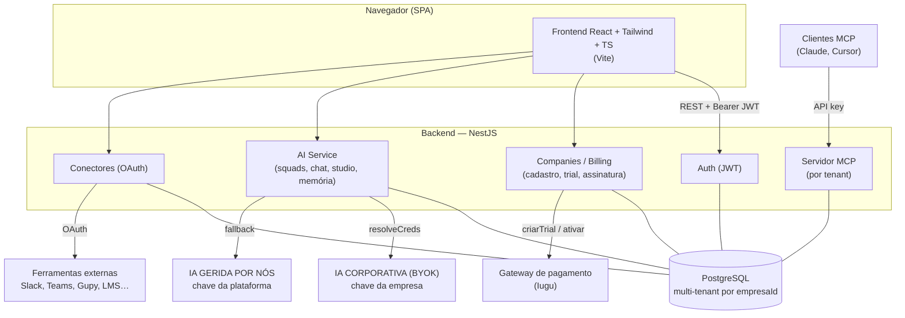

### 4.3. Autenticação e isolamento

- **Login:** `POST /login { username, password } → { authToken, user }`. Token JWT armazenado em `localStorage` (`authToken`) e enviado em `Authorization: Bearer`.
- **Rate limit** estrito no login (5 tentativas / 60s) e *dummy hash* para equalizar tempo de resposta (mitiga enumeração de usuários).
- **Guarda de rotas:** o frontend tem `AuthGuard`; rotas públicas (`/login`, `/cadastro`, `/onboarding`) vs protegidas.
- **Isolamento multi-tenant:** o `empresaId` vem do JWT; **toda** query de dados de negócio filtra por `empresaId`. A fábrica deve garantir que nenhum endpoint aceite `empresaId` do corpo/query do cliente — sempre do token.

### 4.4. Design System / Template (fora do escopo de criação) 🟢

> O template de design system **já existe** e não deve ser recriado. A fábrica **consome** os componentes e tokens existentes.

- Base: template **Tailux** (admin React + Tailwind) já integrado.
- **Tema da marca (beculture)** em `src/styles/beculture-theme.css`, sobrescrevendo as rampas de cor do Tailux:
  - **Primary (dourado/champagne):** `#F0C880` canônico (nível 300); interativo `#C89A3F` (500); hover `#A87A1E` (600).
  - **Neutros quentes (structure):** preto da marca `#010101` (900), fundo `#F5F5F5` (100), bordas `#D5D5D5` (300), texto secundário `#868686` (500).
  - **Success (verde de conversão):** `#00A650`.
  - **Tipografia:** **Host Grotesk**.
- Suporte a **tema claro/escuro** já previsto (assinaturas de logo `-dark`).

Entregáveis de design que a fábrica reutiliza: componentes de layout (sidebar, header/prompt bar), cards, inputs, botões (primário dourado, conversão verde), modais e tabelas.

---

## 5. Modelo de Dados

> Fonte de verdade: `ts/api/prisma/schema.prisma`. O schema **espelha** os tipos do frontend, garantindo contrato único.

### 5.1. Diagrama de entidades (atual + extensão de grupo)

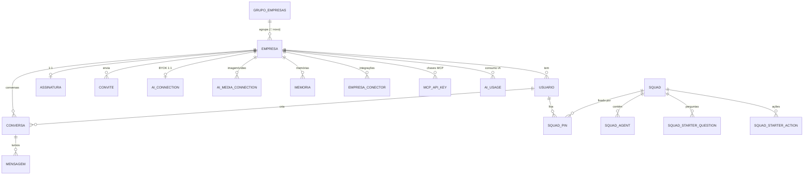

### 5.2. Entidades principais

| Entidade | Papel | Campos-chave |
|---|---|---|
| **`GrupoEmpresas`** 🔴 | Holding/rede que agrupa empresas | id, razaoSocial, ownerId |
| **`Empresa`** 🟢 | Tenant que contrata | tipoPessoa (pj/pf), documento (CNPJ/CPF), plano, ciclo, modulos[], setor, onboardingConcluidoEm |
| **`Usuario`** 🟢 | Quem faz login | empresaId, nome, email (único), senhaHash, role, **trialStartsAt/EndsAt** |
| **`Convite`** 🟢 | Convite de membro | empresaId, email, role, status |
| **`Assinatura`** 🟢 | Cobrança (1:1 c/ empresa) | plano, ciclo, status, usuarios, posicoes, preços (snapshot), total, metodoPagamento, gatewayRef |
| **`AiConnection`** 🟢 | Conexão de IA BYOK (LLM) | provider (anthropic/openai), model, **apiKeyEncrypted** (AES-256-GCM), keyLast4, status |
| **`AiMediaConnection`** 🟢 | Conexão de IA de mídia | kind (image/video), provider, model, apiKeyEncrypted |
| **`Squad`** 🟢 | Grupo de agentes de um domínio | id (code), slug, title, description ("quando usar"), order, active |
| **`SquadAgent`** 🟢 | Persona de IA no squad | position, **reference** (pessoa personificada), who, contribution, **prompt**, model? (override) |
| **`SquadStarterQuestion`** 🟢 | Perguntas para começar | text, order |
| **`SquadStarterAction`** 🟢 | Ações que a IA pode executar | text, order |
| **`SquadPin`** 🟢 | Squad fixado por um usuário | usuarioId, squadId, order |
| **`Memoria`** 🟢 | Fato que a IA lembra da empresa | categoria, titulo, conteudo, origem, confianca, ativa, **corporativa** (read-only) |
| **`EmpresaConector`** 🟢 | Integração ativada | connectorId, origem (app/mcp/oauth), tokens OAuth criptografados |
| **`McpApiKey`** 🟢 | Chave do servidor MCP | nome, keyHash (SHA-256), last4, revogadaEm |
| **`Conversa` / `Mensagem`** 🟢 | Histórico de chat com squads | squadId, agentId?, titulo · role (user/assistant), conteudo |
| **`AiUsage`** 🟢 | Consumo de tokens por chamada | entrada, saida, fonte — alimenta contadores 1h/24h/7d |

### 5.3. Notas de modelagem relevantes para a fábrica

- **Catálogo de squads é global** (não por tenant) e semeado via seed a partir de planilha. O schema já documenta a extensão futura para squads por empresa/grupo (`empresaId String?`).
- **Sem FK "duras" para o catálogo** em `Memoria`/`EmpresaConector`/`Conversa`: o `squadId`/`connectorId`/`categoria` são texto validado contra catálogo no service — permite o catálogo evoluir sem quebrar dados históricos.
- **Segredos nunca trafegam crus:** chaves de IA e tokens OAuth ficam **criptografados** (AES-256-GCM); só se expõe `last4`. Chaves MCP só aparecem **uma vez** na criação (guardamos o hash SHA-256).
- **Cascade delete** por `empresaId` em tudo (deletar um tenant limpa seus dados).

---

## 6. Camada de Inteligência Artificial

### 6.1. IA corporativa (BYOK) vs. gerida por nós 🟢

> **Requisito central:** a API de IA pode ser **corporativa** (o cliente usa a própria chave) **ou gerida por nós** (chave da plataforma).

A resolução de credenciais segue uma ordem de prioridade (`ai.service.ts::resolveCreds`):

```
1) A empresa tem AiConnection própria (BYOK)?
      → usa provider + chave DA EMPRESA          (managed = false)
2) Senão, existe chave da plataforma (env)?
      → usa a chave GERIDA POR NÓS               (managed = true)
3) Senão → erro amigável "configure uma conexão de IA".
```

Implicações para a fábrica:
- **BYOK:** tela de "Conexão de IA" onde owner/admin cola a chave (Anthropic/OpenAI), o sistema **valida** a chave (`validateKey`), criptografa e guarda `keyLast4` + `status`.
- **Gerida:** a chave da plataforma vem de variável de ambiente (`ANTHROPIC_API_KEY`); o consumo é medido por tenant (`AiUsage`) para rateio/cobrança.
- O flag `managed` deve ser propagado para telemetria/billing (quem paga o token).
- **Mídia** (imagem/vídeo) tem conexões separadas (`AiMediaConnection`) por modalidade — imagem via OpenAI, vídeo via avatar falante (HeyGen).

### 6.2. Provedores e capacidades 🟢

Interface `LlmProvider` (abstrai Anthropic e OpenAI):

- `streamChat` — resposta em streaming (chat com squads).
- `complete` — resposta única (relatórios longos: Análise, Ata…).
- `completeWeb` — resposta com **busca na web** e fontes citadas (opcional por provedor).
- `validateKey` — valida a chave (401 = inválida).
- Todas expõem **uso de tokens** (`entrada`/`saida`, incluindo cache) para alimentar o `AiUsage`.

### 6.3. Squads e Agentes 🟢

Cada **squad** agrupa **agentes** que personificam referências humanas. O prompt final de uma resposta combina: `prompt do agente` + *framing* da plataforma + **memória de longo prazo da empresa**.

**Catálogo de referência (15 squads):** Comunicação Interna, Conselho Administrativo, Cultura, Dados & BI, Financeiro, Gestão de Pessoas, Jurídico, Marketing, Processos, Produto, Redes Sociais, RH (+ demais).

Tela de um squad — exibe "quando usar", **membros do squad** (agentes/referências), **15 perguntas para começar** e **15 ações que a IA pode executar**, além de chat e painel lateral (Histórico / Documentos):

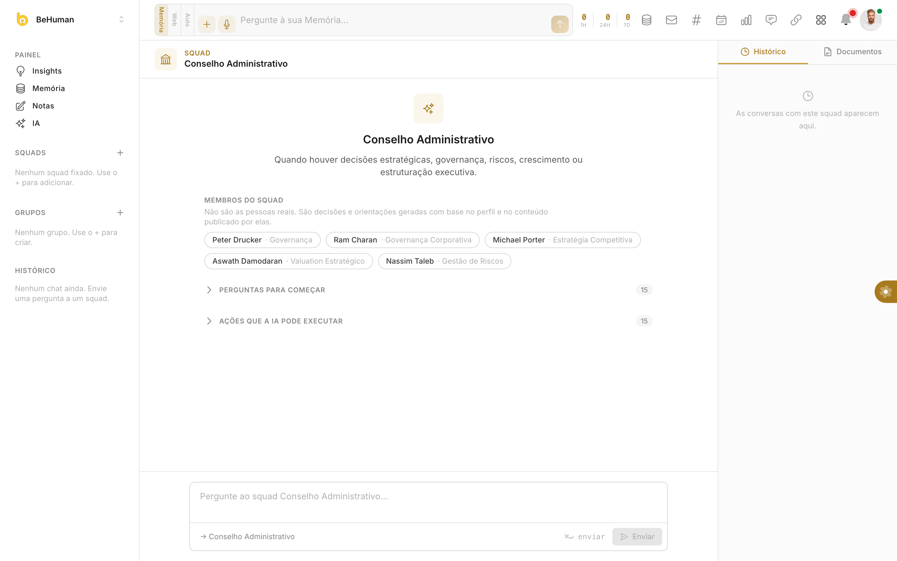

Cada card de agente traz `reference · position` (ex.: *Peter Drucker · Governança*, *Michael Porter · Estratégia Competitiva*, *Nassim Taleb · Gestão de Riscos*). O disclaimer é explícito: *"Não são as pessoas reais. São decisões e orientações geradas com base no perfil e no conteúdo publicado por elas."*

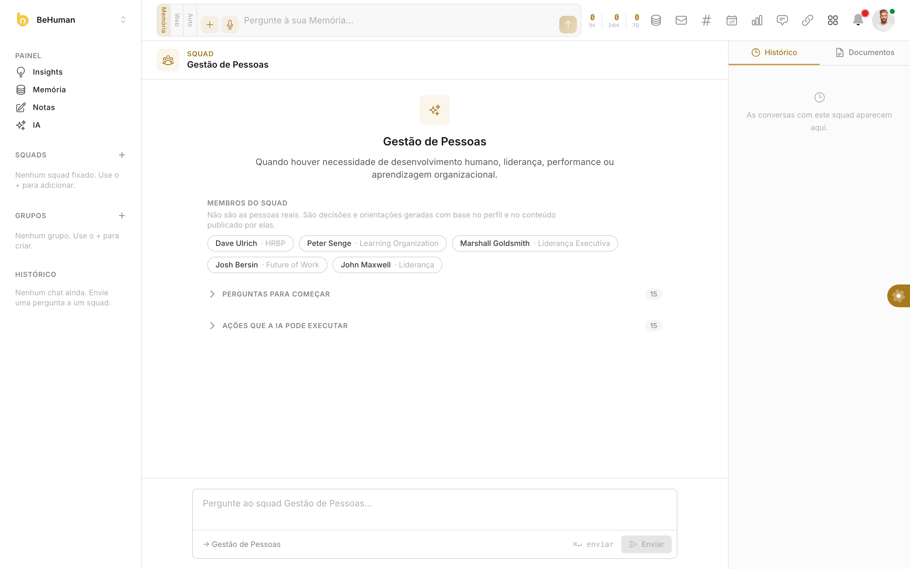

**Requisitos funcionais do squad:**
- Fixar/desafixar squads na sidebar (`SquadPin`, por usuário).
- Chat com o squad inteiro **ou** com um agente específico (`agentId`).
- Perguntas e ações sugeridas viram atalhos que iniciam uma conversa.
- Histórico de conversas por usuário/empresa; título derivado da 1ª mensagem.
- CRUD administrativo de squads/agentes (ordenação, ativar/desativar, override de modelo por agente).

### 6.4. Memória corporativa (Diretrizes) 🟢

Base de conhecimento de longo prazo **por empresa**. Cada memória **ativa** é injetada no contexto das respostas (personalização tipo RAG leve).

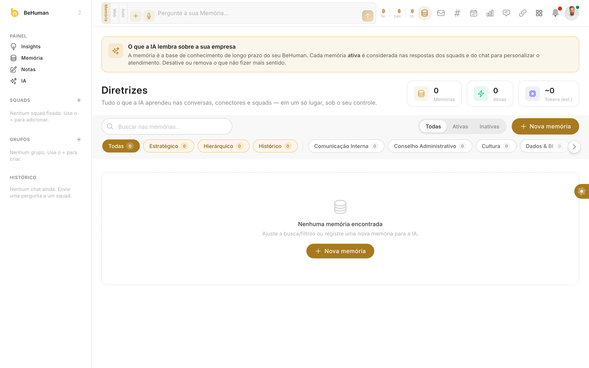

- Campos: `categoria` (slug de squad ou tema transversal: estratégico/hierárquico/histórico), `titulo`, `conteudo`, `origem`, `confianca` (alta/média/baixa), `ativa`, `corporativa`.
- **`corporativa = true`** → definição read-only: o membro não pode desativar/editar/remover (política da empresa/grupo). 🔴 No nível de grupo, memórias corporativas podem ser herdadas por todas as empresas.
- Contadores no topo: total de memórias, ativas e **tokens estimados** (impacto no contexto).
- Origem automática: a IA registra memórias a partir de conversas, conectores e squads.

### 6.5. IA Studio — funções nativas de conteúdo 🟢

Estúdio de geração/transformação de conteúdo. Cada função é um controller/endpoint próprio no backend.

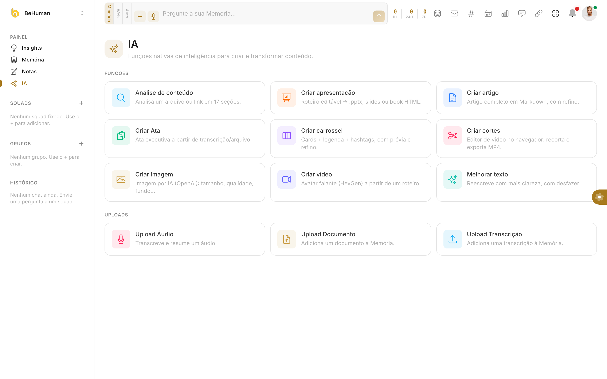

| Função | O que faz |
|---|---|
| **Análise de conteúdo** | Analisa um arquivo/link em 17 seções |
| **Criar apresentação** | Roteiro editável → `.pptx`, slides ou book HTML |
| **Criar artigo** | Artigo completo em Markdown, com refino |
| **Criar Ata** | Ata executiva a partir de transcrição/arquivo |
| **Criar carrossel** | Cards + legenda + hashtags, com prévia |
| **Criar cortes** | Editor de vídeo no navegador (recorta/exporta MP4) |
| **Criar imagem** | Imagem por IA (OpenAI) — tamanho, qualidade, fundo |
| **Criar vídeo** | Avatar falante (HeyGen) a partir de um roteiro |
| **Melhorar texto** | Reescreve com mais clareza (com desfazer) |
| **Uploads** | Áudio (transcreve + resume), Documento e Transcrição → adicionam à Memória |

### 6.6. Medição de uso (billing de IA) 🟢

- Cada chamada ao modelo gera um evento `AiUsage` (entrada/saída de tokens, fonte).
- Contadores por **janelas de 1h / 24h / 7d** exibidos no header (ver prints do app).
- Eventos > 7 dias são podados.
- Escopo por usuário, dentro da empresa → permite cotas, rateio e limites por plano. 🔴 (definir cotas por plano)

### 6.7. Servidor MCP por tenant 🟢

O BeHuman expõe um **endpoint MCP** (`/mcp`) para clientes externos (Claude, Cursor) consumirem os dados/ferramentas da empresa. Autenticação por **API key** (`McpApiKey`): a chave crua é exibida uma única vez; em repouso guarda-se só o hash SHA-256; suporta rótulo, `lastUsedAt` e revogação (soft-delete para auditoria).

---

## 7. Mapa de Módulos e Telas

### 7.1. Estrutura de navegação 🟢

O app é organizado em **Produtos** (switcher no topo da sidebar). O produto principal é o **BeHuman**; os demais são módulos comerciais.

- **BeHuman** — Painel (Insights, Memória, Notas, IA), Squads (fixáveis), Grupos, Histórico.
- **Learning** — Universidade, Meus Treinamentos, Equipe·LMS. 🟡
- **Performance** — 1:1s, Ciclo de Desempenho (autoavaliação, 360, gestor, feedback, PDI, calibração), Elogios, Metas/OKRs. 🟡
- **Project Management** — Alocação de Horas, Organização. 🟡
- **Hiring** — Vagas, Candidatos, Banco de CVs, WhatsApp, Divulgação, Campanhas. 🟡

**Áreas de sistema** (ícones do topo, escopadas ao produto): Feed, Email, Slack, Agenda, CRM, WhatsApp, Eventos, Comunidades, Organograma, Pesquisas, Diretrizes, Conectores, Agentes, Chat, Documentos, Minhas Tarefas, Calendário, FAQ, Aprovações, Atalhos, Bloco de Notas, Formulários, Automações, Tour, Atualizações, Configurações.

> Nem todas as áreas estão implementadas — várias exibem "em construção" (placeholder). O escopo prioritário construído é o do produto **BeHuman** (abaixo). A fábrica deve tratar as demais como **roadmap**.

### 7.2. Autenticação — Login 🟢

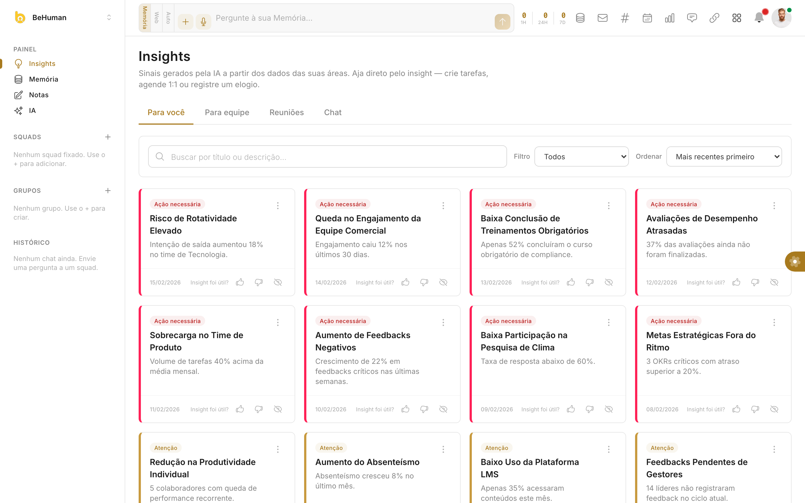

Login por usuário/senha + SSO Google/Microsoft (previsto). "Create account" leva ao `/cadastro` (trial).

### 7.3. Painel — Insights 🟢

Página inicial do BeHuman. Sinais gerados por IA a partir dos dados das áreas; o usuário **age direto pelo insight** (criar tarefa, agendar 1:1, registrar elogio). Abas: Para você · Para equipe · Reuniões · Chat. Filtros, busca e ordenação; severidade por cor ("Ação necessária" / "Atenção"); feedback de utilidade (👍/👎/ocultar).


Note o **header global** (prompt bar "Pergunte à sua Memória…", modos Memória/Web/Auto, upload de áudio, contadores de uso de IA 1h/24h/7d, e ícones das áreas de sistema).

### 7.4. Painel — Memória (grafo) 🟢

Visualização em grafo da Memória, montada a partir de notas `.md`, `[[wikilinks]]`, tags e pastas (estilo Obsidian). Estado inicial pede a seleção da pasta de origem.

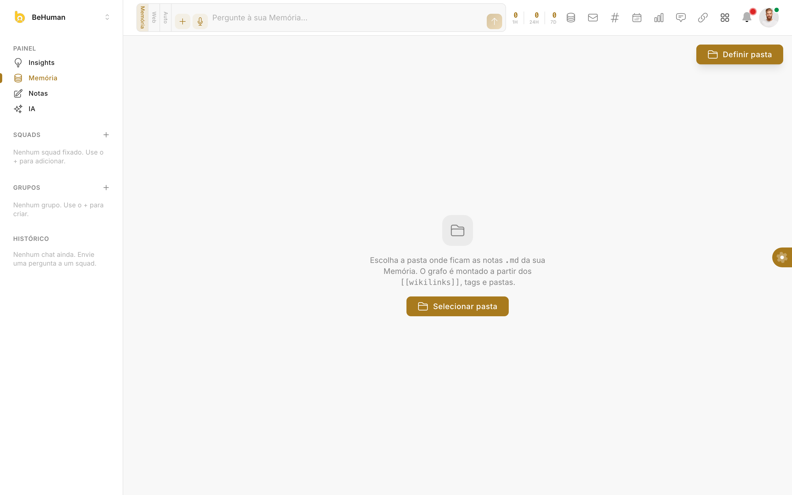

### 7.5. Painel — Notas 🟢

Bloco de notas do usuário (migrado do app de origem). 🟢

### 7.6. Conectores 🟢

Catálogo de **53 integrações** em **12 categorias** (Comunicação, Identidade & Acessos, RH & Folha, Recrutamento, Produtividade & Projetos, BI & Analytics, Automação…). Cada card mostra o objetivo e as **permissões** solicitadas, com botão **Conectar**. Integrações com fluxo real usam **OAuth** (ex.: Slack) e guardam tokens criptografados. Também há um bloco **IA & Modelos** (onde se configura BYOK).

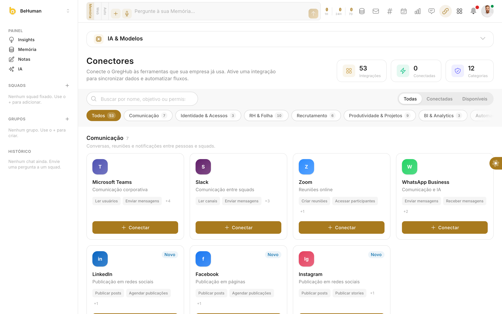

### 7.7. Documentos 🟢

Gerenciador de arquivos por empresa: pastas, upload, visualização e download (imagens, XLSX, PDF…). Contadores de pastas/arquivos/imagens.

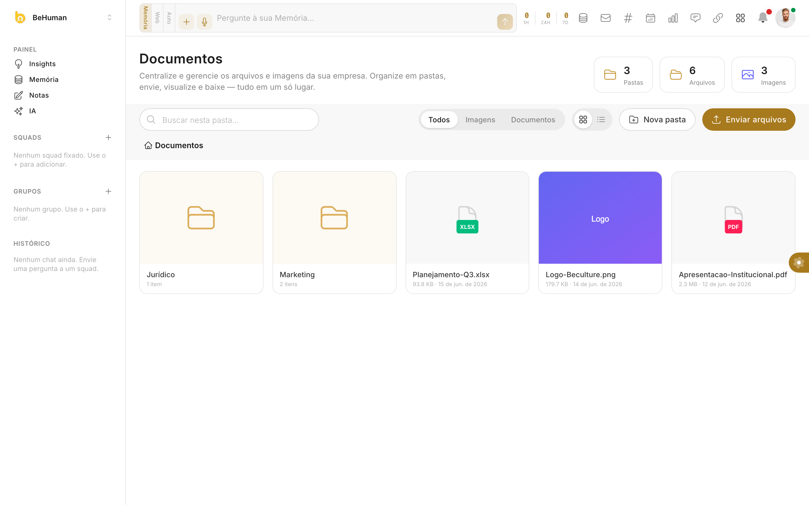

### 7.8. Áreas em construção 🟡

Diversas áreas de sistema (ex.: **Configurações**, Agentes, Chat dedicado, Organograma) hoje são placeholders. Servem de mapa do roadmap para a fábrica.

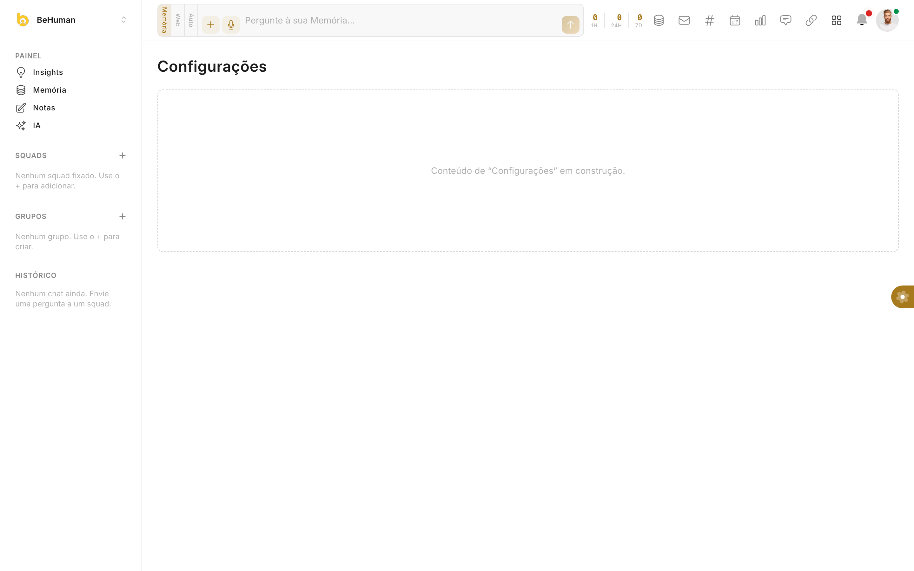

---

## 8. Requisitos Não-Funcionais

### 8.1. Segurança e conformidade

- **Senhas:** hash **bcrypt**; nunca em texto plano.
- **Segredos (chaves de IA, tokens OAuth):** criptografia **AES-256-GCM** em repouso; exibição só de `last4`.
- **Chaves MCP:** hash SHA-256; chave crua exibida uma única vez; revogação com trilha de auditoria.
- **JWT** com expiração; `Authorization: Bearer`.
- **Rate limiting** (throttler) no login e em endpoints sensíveis.
- **Isolamento de tenant:** `empresaId` sempre do token, nunca do input do cliente.
- **LGPD:** dados pessoais isolados por tenant; cascade delete por empresa; prever export/retenção. Plano Expert cita "LGPD avançado". 🔴 detalhar DPA, retenção e direito ao esquecimento.
- **SSO/SAML:** requisito do plano Expert. 🔴

### 8.2. Internacionalização

- Interface em **pt-BR** (público Brasil). Estruturar textos para futura i18n. 🟡

### 8.3. Performance, escala e disponibilidade

- Multi-tenant num único banco Postgres com índices por `empresaId`.
- Respostas de IA em **streaming** (UX responsiva).
- SLA/uptime: Expert cita **99,9%** e suporte 24/7. 🔴

### 8.4. Observabilidade

- `AiUsage` como base de telemetria de consumo de IA.
- 🔴 Prever logs estruturados, métricas e alertas (erros de gateway, falhas de validação de chave, cotas).

---

## 9. Integrações e Conectores

- **Catálogo global e estático** de conectores (espelhado entre front e back). O estado por empresa é a existência de `EmpresaConector`.
- **Origens de conexão:** `app` (UI), `mcp` (ferramenta MCP) ou `oauth` (autorização no provedor).
- **OAuth real** já implementado para Slack (troca de código, `teamId`/`teamName`, `scopes`, token criptografado). Demais conectores seguem o mesmo padrão. 🔴
- Categorias principais: Comunicação (Teams, Slack, Zoom, WhatsApp Business, LinkedIn, Facebook, Instagram), Identidade & Acessos, RH & Folha, Recrutamento (ex.: Gupy), Produtividade & Projetos, BI & Analytics, Automação.

---

## 10. Checklist de Requisitos do Cliente (para a fábrica)

| # | Requisito | Estado na referência | Ação da fábrica |
|---|---|---|---|
| R1 | **Contratação self-service modelo ClickUp** (trial 14 dias sem cartão) | 🟢 funil + cálculo de preço; billing mockado | Integrar gateway real (Iugu) via `BillingService` |
| R2 | **Site público de contratação** (planos → cadastro → app) | 🟢 `/cadastro` | Conectar a landing/marketing e SEO |
| R3 | **Hierarquia Grupo de Empresas → Empresa → Usuários** | 🟢 Empresa→Usuários; 🔴 Grupo | Adicionar `GrupoEmpresas`, `grupoId`, faturamento e memórias de grupo |
| R4 | **IA corporativa (BYOK) ou gerida por nós** | 🟢 `resolveCreds` (BYOK → managed) | Tela BYOK + cotas por plano + rateio da chave gerida |
| R5 | **React + Tailwind + TypeScript** | 🟢 | Manter stack |
| R6 | **Design system pronto (não recriar)** | 🟢 tema beculture sobre Tailux | Consumir componentes/tokens |
| R7 | Squads de IA com agentes personificados | 🟢 catálogo (15 squads) | CRUD admin + evolução de prompts |
| R8 | Memória corporativa injetada nas respostas | 🟢 | Memórias herdáveis por grupo |
| R9 | IA Studio (ata, apresentação, artigo, imagem, vídeo…) | 🟢 | Robustez, filas e limites |
| R10 | Conectores + OAuth + MCP por tenant | 🟢 (Slack OAuth; MCP) | Ampliar conectores reais |
| R11 | Planos/módulos/precificação parametrizáveis | 🟢 em código | Persistir tabela editável pelo comercial |
| R12 | SSO/SAML, SLA 99,9%, LGPD avançado (Expert) | 🔴 | Implementar |

---

## 11. Roadmap sugerido de entregas

**Fase 1 — Fundação comercial (habilita receita)**
- Integração de pagamento real (Iugu) atrás do `BillingService`.
- Tabela de preços/planos persistida e editável.
- Fluxo trial → checkout → assinatura ativa ponta a ponta.

**Fase 2 — Grupo de Empresas (R3)**
- Entidade `GrupoEmpresas`, `grupoId` em Empresa/Assinatura.
- Administração e faturamento consolidados; papel `group_admin`.
- Memórias e squads herdáveis por grupo.

**Fase 3 — IA robusta (R4, R9)**
- Telas BYOK (LLM e mídia) com validação de chave.
- Cotas de tokens por plano e rateio da chave gerida.
- Filas/limites para o IA Studio.

**Fase 4 — Módulos comerciais (Learning, Performance, Hiring, PM)**
- Sair de placeholder para funcional, um módulo por vez.

**Fase 5 — Enterprise (R12)**
- SSO/SAML, SLA, observabilidade, LGPD avançada, API dedicada.

---

## 12. Anexos

- **Capturas de tela:** pasta [`prints/`](prints/) — 01 a 15.
- **Schema de dados:** `ts/api/prisma/schema.prisma` (fonte de verdade).
- **Contrato de billing:** interface `BillingService` (§2.6).
- **Resolução de credenciais de IA:** `ai.service.ts::resolveCreds` (§6.1).

> **Nota de marca:** a UI de referência usa a marca **beculture®** e há nomes legados no código (*GregHub*, *Confi*). O nome de produto adotado neste documento é **BeHuman**. O arquivo `beautyin-design-system.md` na raiz do repositório refere-se a **outra marca** (suplementos) e **não** se aplica a este produto.
